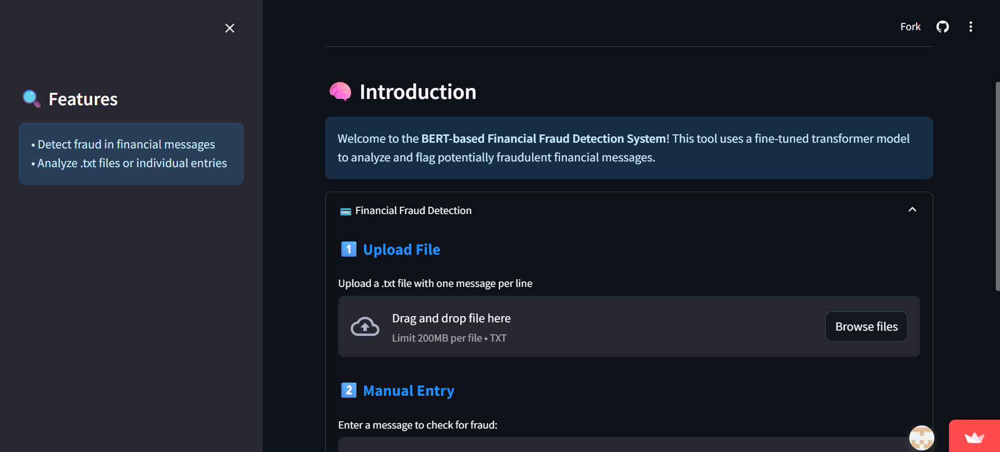
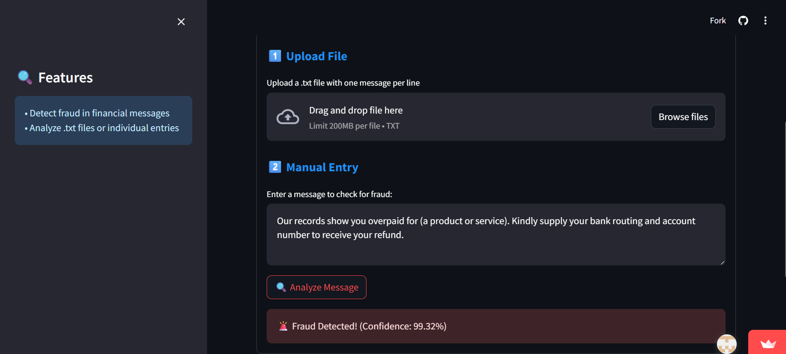

# financial_fraud_detection

This is the **BERT algoritm based Financial Fraud Detection** System developed using BERT Transformer model and trained on Kaggle dataset which contains message data and label that message is spam/ham. 

Dataset contains **746 Spam** messages and **4826 ham (non-spam)** messages

This model also gives chances or percentage of message being spam or ham.

